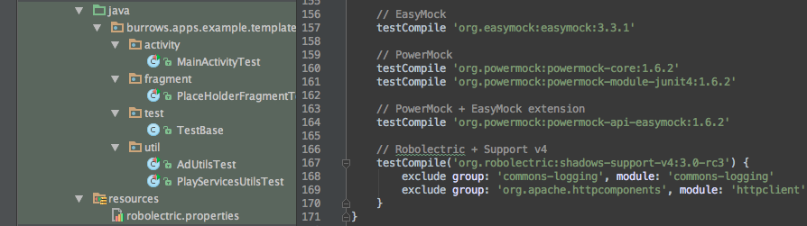

AndroidGradleTemplate  
=========
Gradle + Android Studio + Robolectric + Espresso + Mockito + EasyMock/PowerMock + JaCoCo

##### Works with the following Configurations:
 - Multiple Modules
 - Multiple Flavors
 - Android Libraries

## Technologies used:
#### Build Tools:
|Name|Version|Description|
|---|---|---|
| [Gradle](http://gradle.org/docs/current/release-notes) | v2.4 | Gradle build system |
| [Android Gradle Build Tools](http://tools.android.com/tech-docs/new-build-system) | v1.2.3 | Official Gradle Plugin |
| [Android SDK](http://developer.android.com/tools/revisions/platforms.html#5.1) | v22 | Official SDK |
| [Android SDK Build Tools](http://developer.android.com/tools/revisions/build-tools.html) | v22.0.1 | Official Build Tools |
| [Android Studio](http://tools.android.com/recent) or | v1.2+ | Official IDE |
| [Intellij](https://www.jetbrains.com/idea/download/) | v14.1.3+ | Intellij IDE |

####Android Libraries:
|Name|Version|Description|
|---|---|---|
| [Android Support-v4 ](http://developer.android.com/tools/support-library/features.html#v4) | v22.0.1 | Support Library API 4+|
| [Android AppCompat-v7](http://developer.android.com/tools/support-library/features.html#v7-appcompat) | v22.0.1 | Support Library API 7+|
| [Android Google Play Services](https://developer.android.com/google/play-services/index.html) | v7.3.0 | Admob, Analytics, etc

####Testing Frameworks:
|Name|Version|Description|
|---|---|---|
| [JUnit](https://github.com/junit-team/junit) | v4.12 | Java Unit Testing Framework |
| [Hamcrest](https://github.com/hamcrest/JavaHamcrest) | v1.3 | Matchers for Unit Tests |
| [Espresso](https://code.google.com/p/android-test-kit/wiki/Espresso) | v2.1 | Google's *New* Instrumentation Framework |
| [Robolectric](https://github.com/robolectric/robolectric) | v3.0-RC3 | Unit Testing Framework |
| [Mockito](https://github.com/mockito/mockito) | v1.10.19 | Mocking Framework |
| [EasyMock](https://github.com/easymock/easymock) | v3.3.1 | Mocking Framework |
| [PowerMock](https://github.com/jayway/powermock) | v1.6.2 | Mocking Framework(static method support) |

####Reporting Plugins:
|Name|Version|Description|
|---|---|---|
| [JaCoCo](http://www.eclemma.org/jacoco/) | v0.7.4.201502262128 | JaCoCo Test Coverage |
| [Coveralls](https://coveralls.io/) | N/A | Hosts test reports published from TravisCI |

####Continuous Integration:
|Name|Description|
|---|---|
| [TravisCI](http://docs.travis-ci.com/user/languages/android/) | Build Server(Builds, Tests, Publishes reports to Coveralls) |

# Getting Started:
 - [View JUnit and Hamcrest Tests](Example-AllLibraries/src/test/java/burrows/apps/example/template/util/AdUtilsTest.java)
 - [View Robolectric Activity Tests](Example-AllLibraries/src/test/java/burrows/apps/example/template/activity/MainActivityTest.java)
 - [View Robolectric Fragment Tests](Example-AllLibraries/src/test/java/burrows/apps/example/template/fragment/PlaceHolderFragmentTest.java)
 - [View EasyMock/PowerMock Tests](Example-AllLibraries/src/test/java/burrows/apps/example/template/util/PlayServicesUtilsTest.java)

## `Android Studio` or `Intellij` Support(Simple):
 - **Import/Open this project with Android Studio/Intellij(click on `build.gradle`)**

 - **Instrumentation Tests:**
  - Change the Build Varient Test Artifact to `Instrumentation Tests` 
  - Right click an instrumentation test located in `src/main/androidTest` and click test

 - **Unit Tests:**
  - Change the Build Variant Test Artifact to `Unit Tests`
  - Right click a unit test located in `src/main/test` and click test

## Comand Line(Advanced):
##### Clone with `Git`:
 - `git clone https://github.com/jaredsburrows/AndroidGradleTemplate.git`
 - `cd AndroidGradleTemplate`

##### Installing/Running with `Gradle`:
 - **Install the `debug flavor` on your Android Device:**
   - `gradlew installDebug`
 - **Install and Run the `debug flavor` on your Android Device:**
   - `gradlew runDebug` 

##### Running Instrumentation Tests with `Gradle`:
 - **Run all instrumentation tests in all `flavors`:**
   - `gradlew connectedAndroidTest`
 
##### Running Unit Tests with `Gradle`:
 - **Run all unit tests in all `flavors`:**
   - `gradlew test`
 - **Run a single unit test in all `flavors`:**
   - `gradlew test --tests="*MainActivityTest*"`
 - **Run all unit `debug flavor` tests:**
   - `gradlew testDebug`
 - **Run a single unit test in the `debug flavor`:**
   - `gradlew testDebug --tests="*MainActivityTest*"`
 - **Run a single unit test in the `debug flavor` with `Jacoco` test reports:**
   - `gradlew testDebug --tests="*MainActivityTest*" jacocoTestReport`

License
=========

    Copyright (C) 2015 AndroidGradleTemplate by Jared Burrows
   
    Licensed under the Apache License, Version 2.0 (the "License");
    you may not use this file except in compliance with the License.
    You may obtain a copy of the License at

       http://www.apache.org/licenses/LICENSE-2.0

    Unless required by applicable law or agreed to in writing, software
    distributed under the License is distributed on an "AS IS" BASIS,
    WITHOUT WARRANTIES OR CONDITIONS OF ANY KIND, either express or implied.
    See the License for the specific language governing permissions and
    limitations under the License.
